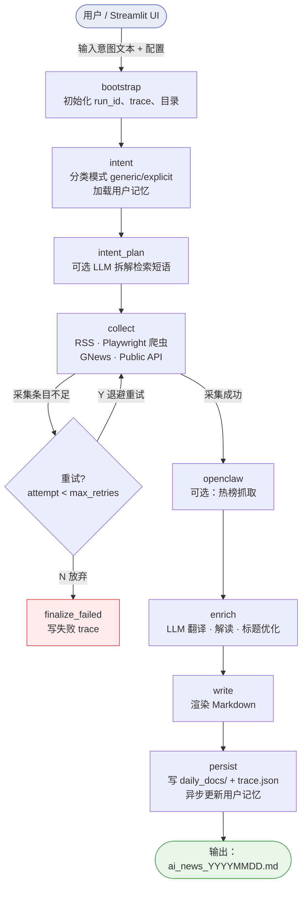

# AI 行业新闻智能体（AI News Agent）

> 原名"AI 资讯周报 Agent"，现已更名并重新定位。  
> 本项目不是定时周报，而是**按需驱动、意图感知**的 AI 行业资讯智能体：用户描述意图，Agent 自动规划任务、调用工具抓取、LLM 翻译富化，最终输出结构化报告。

---

## 项目目标

解决三个实际问题：

- **信息太散**：官方新闻、行业媒体、论文、开源动态分布在不同平台
- **信息太杂**：同质内容多、噪声高、难以持续关注
- **输出不稳定**：多数工具只能抓取，难以产出结构清晰、可持续阅读的报告

因此本项目聚焦**按用户意图输出可读报告**，而不是做重型资讯平台，也不依赖固定的定时任务。

---

## 核心流程

整体遵循 **"意图解析 → 任务规划 → 工具调用 → LLM 翻译富化 → 输出结果"** 五段流水线，由 LangGraph 状态图编排，失败可自动重试。

### 1. 意图解析：泛化搜索 vs 关键词搜索

用户输入的意图文本首先经由 `classify_query_mode()` 自动分类为两种模式：

| 模式 | 典型触发 | 行为说明 |
|------|---------|---------|
| **generic（泛化浏览）** | "看看最近有什么资讯"、"随便看看"、"来份周报" | 将用户长期记忆中的偏好关键词、板块偏好合并进意图；采集后按记忆偏好对条目重排加权 |
| **explicit（关键词检索）** | "查视频模型"、"搜 HuggingFace 论文"、"OpenAI 最新动态" | 仅以当前句意图做检索，不合并历史偏好；严格过滤与关键词不相关的条目 |

### 2. 任务规划（intent_plan_stage）

- 可选调用 LLM 将意图文本拆解为多组英文 + 中文检索短语（用于 GNews 等英文数据源）
- 将用户记忆中的偏好板块、排除信源、额外关键词按模式注入配置
- 生成本次运行的 `intent_plan`，贯穿后续阶段

### 3. 工具调用（collect_stage）

并发调用多类信源采集工具：

| 工具类型 | 实现 | 说明 |
|---------|------|------|
| **RSS/Atom 拉取** | `collect_news()` + `sources.json` | 覆盖官方 Blog、学术、媒体、中文资讯等多类信源 |
| **站点 Playwright 爬虫** | `crawlers/site/*.py` | OpenAI、Anthropic、HuggingFace、TechCrunch、VentureBeat 精准列表页爬取 |
| **GNews API** | `fetch_gnews_for_pipeline()` | 按意图短语抓取英文新闻 |
| **Public API 扩展** | `public_api_feeds.py` | NYT、Guardian、Hacker News、GitHub Trending 等 |
| **正文兜底抓取** | `fetch_article_excerpt()` + trafilatura | 对缺失正文的条目补充摘要 |
| **OpenClaw 热榜** | `fetch_openclaw_stars_top()`（可选） | 开启后追加热门 Skill 排行 |

采集后执行：去重 → 关键词过滤（explicit 模式下严格匹配）→ 论文比例控制 → 每来源条数上限 → 全局条数上限。

### 4. LLM 翻译与富化（enrich_stage）

- 对每条原始条目调用 LLM 生成中文解读（目标 200 字以上）
- 生成全局 overview、核心要点列表、中文标题优化
- 模型实例由 `model/llm_factory.py` 统一创建，Prompt 维护在 `prompts/digest_llm_prompts.py`

### 5. 输出结果（write_stage → persist）

- 渲染结构化 Markdown 报告，含来源链接与发布日期（每条可追溯）
- 写入 `daily_docs/ai_news_YYYYMMDD_HHMMSS.md`
- 运行 trace（阶段耗时、条目数、LLM token 等）写入 `runs/<run_id>/trace.json`
- 可选：本次运行后 LLM 异步更新用户长期记忆（`runs/user_news_memory.json`）

---

## 用户长期记忆

存储路径：`runs/user_news_memory.json`

支持字段：

- `profile`：用户描述（自然语言）
- `prefer_categories`：偏好板块（如"官方发布"、"开源与工具"）
- `extra_keywords`：额外关注关键词
- `excluded_source_substrings`：需排除的信源

记忆在 **泛化模式** 下合并进检索配置并影响条目重排；**关键词模式** 下仅保留信源排除过滤，不干扰检索关键词。

关闭记忆：`USER_NEWS_MEMORY_ENABLED=false`

---

## 项目架构树状图

```
ai-news-weekly-agent-main/             <- 仓库根
├── README.md                          # 产品说明、快速命令
├── SKILL.md                           # OpenClaw Skill 触发词与命令
├── sources.json                       # RSS / 信源配置（名称须与爬虫注册表一致）
├── requirements.txt
├── .env.example                       # 环境变量模板（不含真实 key）
│
├── daily_docs/                        # ★ 输出目录：ai_news_YYYYMMDD_HHMMSS.md
├── runs/                              # ★ 运行痕迹目录
│   ├── user_news_memory.json          #   用户长期记忆
│   └── <run_id>/                      #   每次运行子目录
│       └── trace.json                 #   阶段耗时、条目数、LLM token 等
│
├── project/                           # ★ 主代码根（运行时工作目录）
│   ├── app.py                         #   Streamlit 入口（exec ai_news_skill/ui/app.py）
│   ├── run_daily_digest.py            #   ★ 采集核心：RSS/GNews/去重/渲染/写文件
│   ├── langgraph_agent.py             #   薄封装：重导出 orchestration 图
│   ├── agent_runtime.py               #   薄封装：重导出 skill 包阶段函数
│   ├── digest_tools.py                #   工具注册 / 顶层 shim
│   ├── agent_tool_runner.py           #   可选 Tool Agent 路径
│   ├── mcp_bridge.py                  #   MCP 桥接（若启用）
│   │
│   ├── ai_news_skill/                 # ★ 技能包（核心逻辑）
│   │   ├── runtime/
│   │   │   └── agent_runtime.py       #   ★ 各阶段函数：intent / collect / enrich / write / persist
│   │   ├── orchestration/
│   │   │   ├── langgraph_agent.py     #   ★ DigestState + StateGraph + run_with_graph
│   │   │   ├── digest_tools.py        #   工具集注册
│   │   │   └── agent_tool_runner.py   #   ReAct Tool Agent（可选路径）
│   │   ├── pipeline/
│   │   │   └── run_daily_digest.py    #   对顶层脚本的再导出
│   │   ├── crawlers/
│   │   │   └── site/                  #   ★ Playwright 站点爬虫
│   │   │       ├── registry.py        #     爬虫注册表（name -> class）
│   │   │       ├── base.py            #     公共基座（启动参数、代理、超时）
│   │   │       ├── openai_news.py     #     OpenAI Blog 列表页
│   │   │       ├── anthropic_news.py  #     Anthropic Blog（含「See more」交互）
│   │   │       ├── huggingface_blog.py
│   │   │       ├── techcrunch_ai.py
│   │   │       └── venturebeat_ai.py
│   │   ├── integrations/
│   │   │   ├── public_api_feeds.py    #   NYT / Guardian / HN / GitHub Trending...
│   │   │   └── mcp_bridge.py
│   │   ├── user_news_memory.py        #   ★ 用户记忆读写 + classify_query_mode
│   │   └── ui/
│   │       └── app.py                 #   ★ Streamlit Web UI
│   │
│   ├── middleware/
│   │   └── pipeline_middleware.py     #   流水线可观测性（emit_step）
│   ├── model/
│   │   └── llm_factory.py             #   统一创建 LLM 实例
│   ├── prompts/
│   │   └── digest_llm_prompts.py      #   LLM Prompt 维护
│   ├── chains/
│   │   └── news_enrich_chain.py       #   富化链
│   ├── site_crawlers/                 #   旧版/遗留爬虫（与 skill 内 crawlers 并存）
│   ├── test_harness_crawl/            #   爬取实验与样例输出
│   ├── scripts/                       #   一次性脚本
│   └── docs/
│       └── agent-architecture.md      #   英文深度架构详解
│
└── external/                          #   第三方参考（deer-flow / FinnewsHunter 等）；不参与运行时
```

---

## 流程图（LangGraph 编排）



---

## 运行方式

### Streamlit Web UI（推荐）

```bash
cd project
streamlit run app.py
```

在侧栏填入 API Key，主区输入意图文本，点击"运行"即可。

### 命令行

```bash
cd project
python run_daily_digest.py --use-llm --intent-text "查最近视频模型进展"
```

常用参数：

| 参数 | 说明 | 默认 |
|------|------|------|
| `--intent-text` | 意图文本（决定 generic/explicit 模式） | 空（泛化） |
| `--window-hours` | 采集时间窗（小时） | `168` |
| `--max-paper-ratio` | 论文占比上限 | `0.2` |
| `--min-official-items` | 官方新闻最少目标条数 | `3` |
| `--use-llm` | 启用 LLM 富化 | 否 |
| `--fast` | 跳过 Playwright 爬虫（加速） | 否 |

---

## 环境变量与密钥安全

必填：

- `ARK_API_KEY`
- `ARK_ENDPOINT_ID`（推荐）或 `ARK_MODEL`

可选：

- `DIGEST_WEBHOOK_URL`：推送 Webhook
- `SITE_CRAWLERS_ENABLED=false`：关闭 Playwright 爬虫
- `USER_NEWS_MEMORY_ENABLED=false`：关闭用户记忆
- `STRICT_INTENT_MATCH=false`：放宽关键词过滤

开源安全约定：仓库只提交 `.env.example`，真实 key 只存于运行环境，不进仓库、日志或 issue。

---

## 信源类别

1. **官方发布**：OpenAI、Anthropic、Google AI、Meta AI、Microsoft AI 官方 Blog
2. **行业媒体**：TechCrunch AI、The Verge AI、VentureBeat AI、MIT Tech Review AI
3. **论文研究**：arXiv（cs.AI/cs.CL/cs.CV）、Papers with Code、Semantic Scholar
4. **开源动态**：GitHub Trending、Hugging Face Blog/Trending
5. **社区讨论**：Hacker News、Reddit（r/MachineLearning）
6. **中文资讯**：机器之心、量子位、新智元、36Kr AI
7. **国内厂商**：国内大模型厂商官网与开发者平台

---

## 产物与可追溯性

| 类型 | 路径 | 说明 |
|------|------|------|
| 报告 | `daily_docs/ai_news_YYYYMMDD_HHMMSS.md` | 含来源链接与发布日期 |
| 运行 trace | `runs/<run_id>/trace.json` | 阶段耗时、条目数、LLM token |
| 用户记忆 | `runs/user_news_memory.json` | 长期偏好，跨轮次持久化 |
| 抓取异常 | trace + 报告末尾"抓取异常"章节 | 失败信源可见 |

---

## 维护入口速查

| 场景 | 改哪里 |
|------|--------|
| 新增 / 修改信源 | `sources.json` |
| 修改站点爬虫 | `ai_news_skill/crawlers/site/*.py` |
| 修改流程顺序或重试策略 | `ai_news_skill/orchestration/langgraph_agent.py` |
| 修改各阶段行为 | `ai_news_skill/runtime/agent_runtime.py` |
| 修改 LLM Prompt | `prompts/digest_llm_prompts.py` |
| 修改意图分类规则 | `ai_news_skill/user_news_memory.py` → `classify_query_mode()` |
| 英文深度架构说明 | `project/docs/agent-architecture.md` |