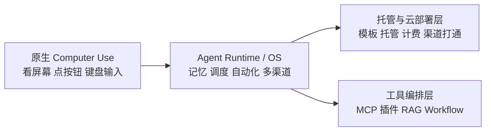

# Computer Use 与 Claw 产品对比研究

- 研究对象：Claude Computer Use、OpenClaw、字节 ArkClaw、阿里云百炼、腾讯云 OpenClaw / Claw 相关产品包装
- 研究日期：2026-04-14
- 研究范围说明：这里的“clawbot”按你的最新定义，不再指某个单独插件或机器人名称，而是指“AI 直接操作屏幕 / 操作软件 / 执行电脑任务”的 Computer Use 产品方向
- 研究方法：以官方新闻稿、官方产品页、官方文档为主；对证据强度不足的内容单独标注，不把社区二次传播当作官方事实
- 说明：Anthropic 开发者文档在当前地域访问受限，因此 Claude Computer Use 的细节主要来自 Anthropic 官方公告与官方研究说明

---

## 一、结论先行

如果把这次研究的问题压缩成一句话：

> 真正意义上的“Computer Use”产品，目前最清晰、最原生、最具方法论代表性的仍然是 Anthropic 的 Claude Computer Use；而 OpenClaw、ArkClaw、阿里云百炼、腾讯云相关 Claw 产品，更多分布在“Agent 基础设施、云托管入口、工具编排平台、生态包装层”，并不都属于同一种产品。

我给出一个先行判断：

1. Claude Computer Use 是“原生计算机操作能力”。它让模型直接看屏幕、移动光标、点击按钮、输入文字，本质是在训练模型去适配现有软件世界。
2. OpenClaw 不是标准意义上的 Computer Use 产品，而是“个人 Agent OS / 自托管 Agent 基础设施”。它能执行任务，也能接浏览器、Shell、文件系统和多种渠道，但核心不只是“操作屏幕”，而是“长期在线 + 多渠道 + 技能 + 自动化 + 记忆”。
3. 字节 ArkClaw 是目前国内最接近 OpenClaw 路线、也最接近“托管型个人 Agent”形态的产品。但从公开材料看，它更强调 7×24 在线智能伙伴、飞书生态协同、多伙伴协作和安全托管，而不是像 Claude 那样把“屏幕级操作”作为第一性能力来定义产品。
4. 阿里云百炼并不是 Computer Use 产品，而是 Agent 构建与工具编排平台。它的强项是模型、插件、MCP、知识库、发布渠道，不是让模型像人一样直接操作桌面软件。
5. 腾讯云在这个方向上最强的官方动作，不是自研原生 Computer Use，而是把 OpenClaw 云端部署、IM 接入、Token Plan、LightClaw 通道、Lighthouse 模板这些能力包装成一整套上云方案。腾讯首页和活动页已经把“Claw”当成运营主题，但官方可验证的核心仍是“OpenClaw 云托管生态”，而非一个和 Claude 对位的原生屏幕操作模型。

所以，如果按“谁最像 Claude 的 Computer Use”来排序：

1. Claude Computer Use：原生定义者
2. OpenClaw：可执行 Agent 基础设施，部分覆盖 Computer Use 场景
3. ArkClaw：托管型 Agent 产品化，更像企业/字节生态版的 Agent OS
4. 腾讯云 Claw 系列：以 OpenClaw 云部署与生态分发为主
5. 阿里云百炼：Agent 平台，不是 Computer Use 本体

---

## 二、先把品类拆开：什么才叫 Computer Use

这一步很关键。如果不先定义品类，就会把所有“会调用工具的 Agent”都误判成一类产品。

我建议把相关产品拆成四层：

1. 原生 Computer Use
定义：模型直接感知屏幕，并以鼠标、键盘、坐标点击、表单填写等方式操作现成软件。

2. Agent Runtime / Agent OS
定义：产品不一定以屏幕控制为核心，但具备任务执行、工具调用、会话记忆、自动化调度、多渠道接入等长期在线能力。

3. 托管/上云包装层
定义：把已有 Agent 或开源系统做成云部署模板、托管入口、统一计费和生态接入方案，降低上手门槛。

4. Tool / MCP / Plugin 编排平台
定义：主要职责是让模型更方便调用外部工具、知识库和服务，但不直接把“像人一样用电脑”作为产品本体。

这四层关系如下：

Claude 站在 A 层。
OpenClaw 更接近 B 层。
ArkClaw 处于 B 和 C 之间。
腾讯云当前主要落在 C 层。
阿里云百炼主要在 D 层，并向 B 层提供搭建能力。

---

## 三、核心对比结论

| 维度 | Claude Computer Use | OpenClaw | 字节 ArkClaw | 阿里云百炼 | 腾讯云 Claw / OpenClaw |
| --- | --- | --- | --- | --- | --- |
| 产品本质 | 原生计算机操作能力 | 自托管个人 Agent OS | 托管型 7×24 智能伙伴 | Agent 开发与编排平台 | OpenClaw 上云部署与生态包装 |
| 是否把“屏幕操作”作为核心定义 | 是 | 否 | 否 | 否 | 否 |
| 官方强调的交互对象 | 屏幕、鼠标、键盘、现成软件 | 聊天渠道、技能、浏览器、Shell、节点设备 | 飞书和办公协作生态、多伙伴协作 | 模型、插件、MCP、RAG、发布渠道 | IM 通道、云主机、模板、Token Plan |
| 典型能力 | 看截图、移动光标、点击、输入 | 多 IM 接入、记忆、技能、文件、Shell、自动化 | 7×24 在线、50+ 技能、多伙伴协同、安全托管 | 插件调用、MCP 服务、知识库、Agent 发布 | 一键部署 OpenClaw、接微信/QQ/企微/飞书 |
| 产品形态 | API 能力 + Beta 能力发布 | 开源基础设施 + 控制平面 | 字节云产品化服务 | 云上平台能力 | 云托管入口 + 运维与生态方案 |
| 与 Claude 的可比性 | 最高 | 中等 | 中等偏低 | 低 | 低 |
| 更像什么 | AI 操作员 | 个人 AI 操作系统 | 托管型数字伙伴 | Agent 工厂 | OpenClaw 云代理商 / 分发层 |

一句话总结这张表：

> Claude 在解决“模型怎么直接用电脑”，OpenClaw / ArkClaw 在解决“Agent 怎么长期活着并真正替你做事”，阿里和腾讯更多在解决“怎么把这些能力更容易接入企业与开发者场景”。

---

## 四、逐个产品拆解

## 4.1 Claude Computer Use：最标准的 Computer Use 定义者

### 4.1.1 官方怎么定义它

Anthropic 在官方公告里明确写到，Computer Use 是公开 Beta 能力，开发者可以通过 API 让 Claude “像人一样使用计算机”，包括：

1. 看屏幕
2. 移动光标
3. 点击按钮
4. 输入文本

更关键的是，Anthropic 官方把这个能力定义为：

> 不是再为模型单独造一套 bespoke tools，而是让模型去适配人类已经在使用的软件与工具。

这就是它和普通 Tool Use 的本质区别。

### 4.1.2 它强在哪里

Anthropic 官方给出的亮点非常集中：

1. 它是“通用计算机技能”，不是某个单独应用插件。
2. 它面向任何现成软件，而非预先为模型量身定制的接口。
3. 在 OSWorld 这类“模型像人一样使用电脑”的评测上，Claude 3.5 Sonnet 官方披露成绩显著高于当时下一名系统。
4. 官方已把它开放到 API、Amazon Bedrock、Google Cloud Vertex AI 这些开发者路径中。

### 4.1.3 它的短板也很明确

Anthropic 官方没有把它包装成“已经成熟可大规模交付的完美能力”，反而反复强调：

1. 仍处于 public beta / experimental 阶段
2. 慢，而且经常出错
3. 滚动、拖拽、缩放等动作仍然困难
4. 截图式观察不是连续视频流，容易错过瞬时状态
5. Prompt injection 会成为新的安全风险入口

这说明 Claude Computer Use 的产品哲学非常清楚：

> 它是能力边界突破，不是成熟工作流平台。

### 4.1.4 它的战略意义

Claude Computer Use 实际上在重写一件事：

> 以后很多软件不必先为 AI 开 API，AI 也能先用“人类界面”完成任务。

这会给大量传统软件带来一个非常强的兼容层红利。

---

## 4.2 OpenClaw：不是纯 Computer Use，而是 Personal Agent OS

OpenClaw 在前一篇报告里已经有完整拆解，这里只讲它和 Computer Use 的关系。

### 4.2.1 它和 Claude 的共同点

1. 都在追求“AI 不只是回答，而是执行”。
2. 都在努力进入真实软件世界，而不是停留在聊天框。
3. 都涉及浏览器控制、文件处理、工具执行、任务自动化。

### 4.2.2 它和 Claude 的根本区别

Claude Computer Use 的第一性问题是：

> 模型怎样直接操作现成电脑界面？

OpenClaw 的第一性问题是：

> 怎样把个人 AI 助手做成长期在线、可接渠道、可扩技能、可托管状态、可自动化执行的系统？

所以 OpenClaw 更像：

1. 有执行能力的 Agent 基础设施
2. 可接浏览器和 Shell 的个人运行时
3. 消息驱动的个人 AI 操作系统

而不是纯粹的“屏幕操作模型”。

### 4.2.3 为什么 OpenClaw 依然重要

因为从产品落地看，真正让用户形成日常依赖的，未必是“会点按钮”这一件事，而是：

1. 你能不能一直在线
2. 能不能接入微信、QQ、飞书、Telegram 这类高频入口
3. 能不能接入记忆、技能、自动化
4. 能不能让不同模型与不同环境共存

这正是 OpenClaw 的长板。

---

## 4.3 字节 ArkClaw：更偏托管型智能伙伴，而不是原生 Computer Use

### 4.3.1 官方定位

字节火山引擎官方产品页对 ArkClaw 的定义是：

> 7×24 在线专属智能伙伴

并突出这些特征：

1. 零门槛开箱即用
2. 支持多智能伙伴协同
3. 专属环境安全可信
4. 飞书原生协同
5. 官方托管、安全合规
6. 50+ 技能

### 4.3.2 它像什么，不像什么

ArkClaw 很像：

1. 字节版托管型 Agent OS
2. 面向办公场景和字节生态的数字伙伴平台
3. 一种比 OpenClaw 更产品化、更托管、更降低运维门槛的方案

ArkClaw 不太像：

1. Claude 式的原生屏幕操作能力
2. 以“截图 + 鼠标 + 键盘”作为核心 selling point 的 Computer Use 产品

### 4.3.3 它和 OpenClaw 的关系

从产品感觉上看，ArkClaw 更接近“云托管产品化版的 OpenClaw 路线”，而不是 Claude 路线。

二者共同点：

1. 都强调长期在线
2. 都强调多技能
3. 都强调任务执行
4. 都更像智能伙伴，而非单次问答模型

ArkClaw 的差异点：

1. 更强调官方托管
2. 更强调与飞书/字节生态的深度结合
3. 更强调套餐、额度、安全与运维体验

### 4.3.4 判断

如果 OpenClaw 是“开源 Agent OS”，ArkClaw 更像“云厂商收敛后的商业托管版 Agent OS”。

---

## 4.4 阿里云百炼：强在 Agent 编排，不在 Computer Use 本体

### 4.4.1 官方能力边界非常清楚

阿里云百炼官方文档把能力重点放在：

1. 智能体应用
2. 插件
3. MCP
4. 知识库
5. 工作流
6. 发布渠道

官方插件包括代码解释器、计算器、搜索、图像生成等；MCP 则被定义为模型连接外部工具的桥梁。

### 4.4.2 为什么它不该被误判为 Computer Use

因为阿里云百炼解决的问题是：

> 怎么让企业和开发者更低门槛地搭建、编排、发布、治理 Agent。

而不是：

> 怎么让模型像人一样看着屏幕直接去操作桌面软件。

官方材料里我没有找到足够强的证据，说明百炼已经把“通用桌面 GUI 操作”作为一项明确产品能力对外发布。

### 4.4.3 它的重要性在哪里

虽然它不像 Claude Computer Use，但它对中国市场其实很关键，因为它代表的是另一条更容易商业化的路径：

1. 企业先需要的是可控的工具调用
2. 再需要的是可治理的 Agent 编排
3. 然后才是更高风险的通用 Computer Use

所以百炼更像“企业 Agent 工厂”，而不是“AI 操作员”。

---

## 4.5 腾讯云：当前更像 OpenClaw 的上云发行方，而非原生 Computer Use 产品方

### 4.5.1 官方最强证据在哪里

腾讯云官方目前最扎实、最可验证的能力，不是一个对标 Claude 的原生 Computer Use 模型，而是：

1. Lighthouse 一键部署 OpenClaw
2. 首发支持 OpenClaw 接入国内主流 IM
3. 提供 LightClaw 作为专属对话通道
4. 提供 Token Plan，支持 OpenClaw、WorkBuddy 等龙虾场景
5. 在活动页、官网运营位上把 OpenClaw / Claw 作为一个重点主题运营

### 4.5.2 这说明腾讯在做什么

腾讯做的更像是：

1. 给 OpenClaw 提供云托管与国内化入口
2. 把 OpenClaw 从“极客项目”包装成“可购买、可配置、可接 IM、可接模型”的上云产品体验
3. 借腾讯云主机、IM 生态、控制台能力，把 Agent 落地门槛进一步压低

### 4.5.3 关于“微信 ClawBot / WorkBuddy Claw / ClawPro”怎么判断

腾讯云官网首页确实出现了这些 claw 命名产品或活动入口，但当前我能直接验证到的、证据最完整的，还是：

1. OpenClaw 上云活动页
2. Lighthouse 产品页里的 OpenClaw 模板
3. 腾讯云开发者社区里的官方/半官方教程体系

因此这里的谨慎结论是：

> 腾讯已经把 claw 作为一个明确运营主题和产品线索，但当前公开证据最强的仍是“OpenClaw 云端部署与通道包装”，而不是一个已经完全独立成型、能与 Claude Computer Use 正面对位的腾讯原生 Computer Use 产品。

### 4.5.4 和混元、元器的关系

腾讯混元是底座模型与多模态模型家族，腾讯元器是智能体创建与分发平台，它们对 claw 方向形成的是底座与生态支持，但不等于已经推出了“像 Claude 那样直接操作电脑”的官方能力定义。

---

## 五、为什么中美两条路线看起来不一样

这里其实反映出两种不同的产品演化逻辑。

### 5.1 Anthropic 路线：先突破能力边界

Anthropic 的做法是先把最难、最有范式意义的能力打出来：

1. 让模型直接适配现有软件
2. 让 AI 成为通用操作员
3. 再围绕安全、评测、API 慢慢完善

这是“能力定义产品”的路线。

### 5.2 中国云厂商路线：先把可落地形态做出来

字节、阿里、腾讯目前更明显的是：

1. 先把 Agent 做成平台
2. 再把工具、插件、知识库、IM、办公生态接好
3. 用托管、套餐、合规、安全来推动商业落地

这是“落地形态定义产品”的路线。

因此你会看到：

1. Anthropic 在强调 screen, cursor, click, type
2. 中国厂商在强调 托管、插件、MCP、办公协同、发布渠道、企业合规

谁更先进，不能简单说；但两者解决的第一问题不同。

---

## 六、如果从产品经理角度判断，这几类产品分别在争夺什么

### 6.1 Claude Computer Use 在争夺“软件通用入口权”

如果 AI 可以不依赖专门 API 就操作现有软件，那它未来天然具备跨 SaaS、跨网站、跨桌面工具的兼容能力。

它争的是：

> AI 成为软件世界统一操作层的权力。

### 6.2 OpenClaw / ArkClaw 在争夺“个人 Agent 操作系统”

它们争的不是某一次操作，而是：

1. 用户每天在哪个入口叫 AI
2. 谁保存长期记忆
3. 谁管理技能生态
4. 谁持有自动化工作流

它们争的是：

> 长期在线的个人 Agent 控制平面。

### 6.3 阿里云百炼在争夺“企业 Agent 生产平台”

它争的是：

> 企业以后用什么平台快速搭建、治理、发布和迭代 Agent。

### 6.4 腾讯云在争夺“Agent 上云分发与中国 IM 接入入口”

它争的是：

> 谁能把 OpenClaw 这类新范式更快接入中国本土聊天、云主机和模型计费体系。

---

## 七、最终判断：谁最值得持续跟踪

### 第一梯队：Claude Computer Use

原因不是它最成熟，而是它最像新范式源头。只要这条路线继续提升速度、稳定性和安全性，很多 SaaS 与 Agent 产品都要被重估。

### 第二梯队：OpenClaw 与 ArkClaw

这两者代表的是“AI 助手真正进入日常工作流”的系统形态。即使未来原生 Computer Use 成熟，用户仍然需要一个长期在线、可记忆、可调度、可接渠道的运行时。

### 第三梯队：腾讯云 Claw 生态

腾讯云不是源头创新者，但很可能是中国市场里最会把这股风潮包装成“能买、能接、能上手、能传播”的发行层玩家之一。

### 第四梯队：阿里云百炼

百炼不一定会先做出最像 Claude 的能力，但如果企业市场先跑通，它反而可能在商业化上比“炫酷的 Computer Use”更快吃到红利。

---

## 八、给你的一个最实用结论

如果你后续是想继续做“产品研究 + 赛道判断”，我建议把这个赛道拆成三条线持续跟踪，而不是混成一个词：

1. 原生 Computer Use 线
代表：Claude Computer Use
重点看：评测、可靠性、安全、速度、可接软件范围

2. Agent OS / Personal Assistant Runtime 线
代表：OpenClaw、ArkClaw
重点看：渠道、记忆、技能生态、自动化、托管方式

3. 企业 Agent 平台与分发线
代表：阿里云百炼、腾讯云 Claw / OpenClaw 发行体系
重点看：插件/MCP、发布渠道、定价、合规、与办公生态结合

如果非要压成一句判断：

> Claude 在定义未来 AI 如何直接使用软件；OpenClaw 和 ArkClaw 在定义未来 AI 如何长期作为你的数字伙伴活着；阿里和腾讯则在定义这些能力如何被企业和中国本土生态真正接进去。

---

## 九、参考来源

1. Anthropic 官方公告：Introducing computer use, a new Claude 3.5 Sonnet, and Claude 3.5 Haiku
2. Anthropic 官方研究说明：Developing a computer use model
3. OpenClaw 官方首页、官方文档、官方 GitHub 仓库
4. 火山引擎 ArkClaw 官方产品页与官方文档
5. 阿里云千问 / 百炼官方产品页、智能体应用文档、插件文档、MCP 文档
6. 腾讯云 Lighthouse 官方产品页、OpenClaw 官方活动页、腾讯云开发者社区 OpenClaw 指南、腾讯混元官方产品页、腾讯元器官方页面

## 十、证据强度备注

1. Claude Computer Use：高。核心判断来自 Anthropic 官方新闻与研究说明。
2. OpenClaw：高。核心判断来自官方文档、官方仓库与前序完整调研。
3. ArkClaw：高。产品定位来自火山引擎官方产品页；但是否具备更深层 GUI Computer Use 能力，当前公开证据不足。
4. 阿里云百炼：高。平台能力边界来自官方文档；当前未发现强证据证明其已经把通用桌面操作定义为产品核心能力。
5. 腾讯云 Claw 相关产品：中。OpenClaw 上云与 Lighthouse 模板证据强；部分 claw 命名产品更多体现为运营/生态入口，独立产品边界仍需进一步核实。