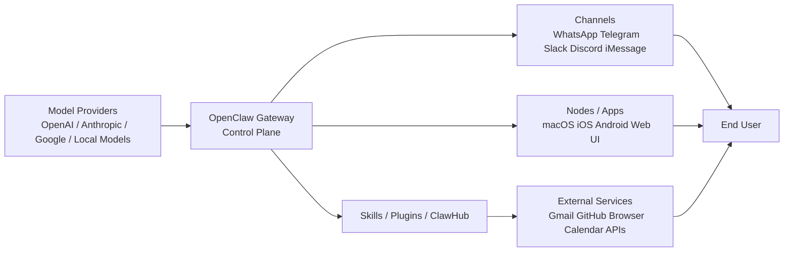
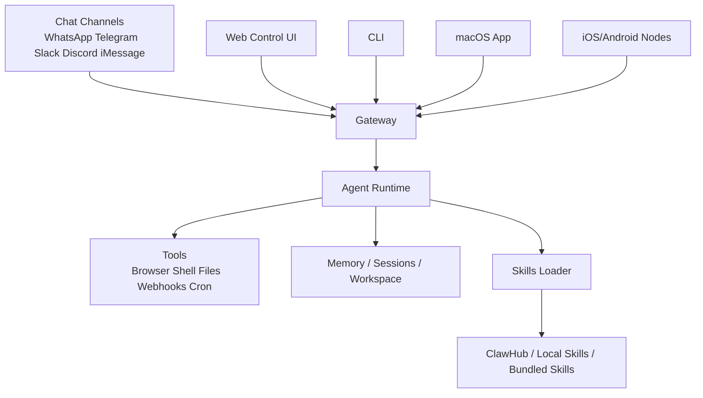

# OpenClaw 产品研究报告

- 研究对象：OpenClaw（外部产品，而非本仓库里的 OpenClaw 接入代码）
- 研究日期：2026-04-14
- 研究方法：基于官方站点、官方文档、官方 GitHub 仓库、官方安全说明、官方博客，以及第三方深度评测进行结构化研究
- 说明：本次未在本地完整安装并跑通 OpenClaw，因此 `Process` 部分以“公开源码逆向 + 文档交叉验证”为主，不把未亲自验证的体验写成既成事实

---

## 一、结论先行

OpenClaw 不是一个普通的 AI Chat 产品，而是一个“自托管、可执行、可扩展、多渠道接入的个人 AI 助手网关”。它把聊天入口、Agent 运行时、技能系统、设备节点、浏览器控制和自动化能力统一到一个 Gateway 控制平面里，让用户可以继续在 WhatsApp、Telegram、Discord、Slack、iMessage 等已有沟通界面里调度 AI 去做事。

如果用一句话概括它的产品本质：

> OpenClaw 不是在卖一个更聪明的对话框，而是在把“个人操作系统级 AI 助手”做成一套可自托管的基础设施。

这也是它和 ChatGPT、Claude、Perplexity、Manus 类产品最关键的区别：

1. 它的主交互不一定发生在独立 App 内，而是嵌入用户已经在用的消息渠道。
2. 它强调“工具执行、记忆、自动化、技能扩展、设备节点”，而不是单纯回答问题。
3. 它的核心护城河更接近“本地控制权 + 可塑性 + 生态 + 持续记忆”，而不是单点模型能力。
4. 它目前公开呈现出的商业形态仍偏开源基础设施和生态平台，尚不是成熟的标准化 SaaS 生意。

判断上，我认为 OpenClaw 代表的是“Personal Agent OS / Personal AI Infrastructure”方向，而不是“聊天应用升级版”。它最值得关注的，不是某个单点 feature，而是它把大量原本割裂的能力拼成了一个长期在线、可被消息驱动、能主动执行任务的个人 Agent 系统。

但也要强调：你的这套研究框架里，商业化、标准化定价、漏斗增长等 SaaS 常规维度，并不完全适合硬套在 OpenClaw 上。OpenClaw 当前更像“高速迭代的开源产品基础设施 + 社区生态 + 技术范式样本”，而非已经完成产品包装的成熟消费级 SaaS。

---

## 二、研究框架：Input / Process / Output

## 2.1 Input：建立高维认知与技术基准

### 2.1.1 商业与战略层

#### 产品定位

官方首页的核心口号是：

> The AI that actually does things.

官方描述的能力包括：清理邮箱、发邮件、管理日历、办理值机，并且这些动作可以通过 WhatsApp、Telegram 等已有聊天渠道触发。

这说明它的战略叙事不是“更强聊天”，而是“更接近真人助理的任务执行”。

#### 为什么这个方向现在会火

从外部信号看，OpenClaw 爆发的时间点踩中了三个趋势重叠：

1. 模型能力溢出。
大模型的纯问答能力已经足够强，市场开始从“更聪明”转向“更能执行”。

2. Agent 工具链成熟。
CLI、Browser、MCP、Webhook、Cron、长期记忆、多 Agent 路由，这些原本分散的能力已经足够成熟，可以被拼装成一个可持续运行的个人代理系统。

3. 用户开始厌倦新的入口。
OpenClaw 很聪明的一点是，不要求用户再学习一个全新前端，而是直接嵌进 Telegram、WhatsApp、Discord、iMessage 等现有界面，这显著降低了“开始用”的心理门槛。

#### 谁在为它买单

现阶段从公开材料看，OpenClaw 不是典型“平台直接收费”的逻辑，更像是：

1. 用户为模型成本买单。
用户自带 OpenAI、Anthropic、Google 或本地模型等 provider。

2. 用户为自己的算力与环境买单。
OpenClaw 本身强调自托管，意味着算力、设备、运维成本主要由用户承担。

3. 生态潜在商业化刚开始显现。
官方已形成 ClawHub 技能市场，并开始围绕技能安全、技能安装、技能更新构建平台能力，但公开材料中尚未看到成熟、稳定、明确的收费体系。

#### 商业壁垒初判

OpenClaw 的壁垒不是单点算法，而是以下组合：

1. 本地控制权。
用户的上下文、记忆、技能、工作区文件、渠道连接都在自己手里，这和托管式 SaaS 有本质差异。

2. 多渠道常驻入口。
它不是只占一个 App，而是在用户原有消息体系里“驻留”。一旦形成习惯，切换成本会逐步升高。

3. 可自我扩展的技能生态。
用户和社区都可以不断增加能力边界，产品形态会随生态增长。

4. 长期记忆与工作流沉淀。
当记忆、自动化、Cron、节点权限、技能配置都围绕个人生活和工作积累之后，迁移成本会越来越高。

#### 价值链位置

OpenClaw 并不直接生产基座模型，而是位于“模型之上、应用之前”的 Agent 基础设施层，向上连接模型 provider，向下连接真实渠道、工具、插件和用户工作流。

它在价值链中的角色更适合定义为：

> Model Orchestrator + Personal Agent Runtime + Channel Gateway + Skill Distribution Layer

这比传统的“中间件”更厚，也比单一“应用”更底层。

### 2.1.2 技术与前沿层

#### OpenClaw 的技术愿景

官方和第三方材料共同指向一个关键词：`personal AI assistant that actually acts`。

从公开能力看，OpenClaw 想解决的不是“模型能不能答对”，而是：

1. 如何让 AI 长期在线。
2. 如何让 AI 在你习惯的渠道里响应。
3. 如何让 AI 拥有长期记忆与个性。
4. 如何让 AI 调用浏览器、文件系统、Shell、节点设备去执行任务。
5. 如何让 AI 自己安装/生成/维护技能。

这意味着它在技术边界上已经超出单轮对话，进入了“长期状态 + 工具编排 + 环境控制 + 安全治理”的综合问题域。

#### 当前能做什么

基于官网、文档和仓库，OpenClaw 已公开支持：

1. 多渠道接入：WhatsApp、Telegram、Discord、Slack、Signal、Google Chat、iMessage、Teams、Matrix、Feishu、WeChat 等。
2. Web Control UI：浏览器管理界面，可聊天、配配置、看会话、看节点。
3. 多 Agent 路由：按 agent、workspace、sender 隔离会话。
4. 浏览器控制：网页浏览、表单填写、网页抓取。
5. 文件与 Shell：读写文件、运行命令、执行脚本。
6. 节点能力：macOS/iOS/Android 设备节点，可接入语音、相机、Canvas、屏幕录制、位置等能力。
7. 技能系统：支持本地技能、打包技能、技能市场 ClawHub。
8. 自动化：Cron、Webhook、心跳任务、Gmail Pub/Sub。
9. 安全机制：配对、Allowlist、Exec 默认 deny、SSRF 防护、技能扫描。

#### 当前边界与风险

它的边界也同样明显：

1. 它不是零门槛消费品。
官方虽然提供一键安装，但本质上还是开发者和高级用户产品。

2. 它把“自由度”换成了“安全复杂度”。
一旦 AI 具备 Shell、Browser、Messaging、Webhook 能力，安全面远大于普通聊天产品。

3. 它的体验依赖模型、技能质量、权限配置和宿主环境。
这意味着产品一致性不如封闭式 SaaS。

4. 它的成本不稳定。
如果用户用高价模型、长上下文、持续心跳和自动化任务，成本会迅速上升。MacStories 的深度体验中提到，其一周内在 Anthropic API 上消耗了约 1.8 亿 tokens，这虽然不是普遍样本，但说明重度使用的成本上限很高。

### 2.1.3 开源与工程层

#### 开源信号

根据官方 GitHub 仓库页面：

1. 仓库为 `openclaw/openclaw`
2. MIT License
3. 约 357k stars
4. 约 72.4k forks
5. 约 1,634 contributors
6. 约 92 个 releases
7. 最新 release 显示为 `2026.4.12`

这些信号说明它不是“概念型开源项目”，而是已经具备非常强的社区传播势能与工程演化速度。

#### 技术栈与结构

从仓库公开信息看：

1. 主体语言是 TypeScript，约 89.9%
2. 同时包含 Swift、Kotlin、Shell 等，说明其客户端和节点能力覆盖多端
3. 仓库内存在 `apps`、`src`、`ui`、`extensions`、`skills`、`docs` 等明确模块
4. 文档中反复强调 Gateway WebSocket 协议、UI 同端口服务、节点角色、设备配对、技能加载顺序

工程上看，它已经不是“脚本项目”，而是有明确协议层、客户端层、插件层、文档层、安全层的完整平台。

---

## 2.2 Process：动手内化与逆向工程

这一步我没有强行本地部署跑通，而是采用更适合当前任务的“轻逆向”方法：

1. 先看官方架构说明和入门文档。
2. 再看 GitHub README、协议文档、Skills 文档、ClawHub 文档。
3. 最后用第三方深度评测去校验“文档说法”和“真实体验感知”是否一致。

### 2.2.1 逆向出来的核心系统结构

基于官方文档与仓库公开内容，OpenClaw 的核心架构可以简化为：

这里最关键的不是“Agent Runtime”本身，而是 Gateway。

官方文档和 README 多次强调：

1. Gateway 是单一控制平面。
2. 所有客户端和节点都通过 WebSocket 协议连接 Gateway。
3. Gateway 负责会话、路由、渠道连接、节点通信和控制界面。

这意味着 OpenClaw 真正的产品中心不是对话 UI，而是 Gateway 这层控制面。

### 2.2.2 我对其产品机制的逆向判断

#### 1. 它不是“Agent + UI”，而是“Gateway + Agent + Interface Mesh”

很多 AI 产品的核心是一个 App，OpenClaw 的核心是一个 Gateway，再外挂多种交互表面。这种设计的好处是：

1. 入口灵活
2. 用户不需要迁移聊天习惯
3. 能同时支持 CLI、Web、手机消息渠道、桌面端、移动节点

代价是：

1. 配置复杂度高
2. 安全面扩大
3. 故障定位更难

#### 2. Skills 是它的第二增长曲线

从文档和代码都能看出，Skills 不是附属 feature，而是平台级能力：

1. 支持多来源加载：extra dirs、bundled、`~/.openclaw/skills`、`~/.agents/skills`、项目 `.agents/skills`、workspace `skills`
2. 有明确优先级和 gating 机制
3. 有 ClawHub 搜索、安装、更新和版本记录
4. UI 和 CLI 都有 Skills 入口

这说明 OpenClaw 在产品上已经把 Skills 作为长期生态层来经营，而不是“示例提示词库”。

#### 3. 它的长期价值建立在“工作区可塑性”上

第三方评测里提到一个很重要的点：OpenClaw 的记忆、配置、技能和用户偏好，本质上都可以以文件/Markdown 形式存在于本地。这意味着：

1. 用户能直接 inspect
2. 用户能手动 patch
3. Agent 自己也能修改自己的工作区能力

这和封闭产品完全不同。它不是“你向一个黑箱提需求”，而是“你和一个可编程的 Agent 系统共同演化一个个人环境”。

#### 4. 它的“魔法感”来自能力拼装，不一定来自模型领先

MacStories 的深度体验给了一个很好的旁证：作者觉得震撼的，不是模型答得更聪明，而是 OpenClaw 能把 Telegram、Shell、Cron、Spotify、Notion、Todoist、语音、图片生成这些能力组合起来，而且很多时候还是让它自己给自己装能力。

这说明 OpenClaw 的用户价值，更多来自：

1. 可执行
2. 可持续
3. 可自我扩展
4. 可嵌入真实工作流

不是来自单次回答质量领先。

### 2.2.3 安全与治理逆向判断

这部分是 OpenClaw 与多数 Agent 项目相比更值得高看的地方。

官方 `trust.openclaw.ai` 和 VirusTotal 合作博客表明，它已经把安全作为公开议题经营，而不是藏在 README 角落里。

关键点包括：

1. 默认 DM pairing
2. 默认 exec deny
3. 默认 self-only 或 allowlist
4. SSRF 防护
5. Gateway 鉴权默认开启
6. 技能上架 VirusTotal 扫描
7. 公开 threat model、security roadmap、code review、security triage 流程
8. 给出 SLA、漏洞提交流程和安全负责人

这说明 OpenClaw 团队已经意识到：

> 真正能“做事”的 Agent，如果没有系统性安全治理，产品越强，风险越大。

这点非常重要，因为很多 Agent 产品只强调“能做什么”，很少认真回答“做错了怎么办”。

---

## 2.3 Output：结构化产品解构

## 三、AI 竞品调研画布

### 3.1 场景定义 Scene

#### 这个产品解决什么问题

OpenClaw 主要解决的是“决策 + 执行”问题，而不是单纯生成问题。

更准确地说，它是：

1. 以聊天形式触发的个人 Agent 系统
2. 通过长期记忆和工作区实现持续个性化
3. 通过工具、技能、节点和自动化实现任务落地

如果用你的画布模板来定义：

- 不是单纯创意生成
- 不是单纯信息预测
- 核心是 Agent 驱动的执行与编排

#### 核心体验流程

1. 用户在熟悉的渠道中发消息
2. Gateway 接收消息并路由到对应 agent/session
3. Agent 判断是否调用技能、工具、浏览器、节点、外部服务
4. 结果通过原渠道返回
5. 相关上下文、记忆、技能和自动化可以持续积累

### 3.2 模型层 Model

#### 可能使用什么底座模型

官方明确支持多个 provider，包括 Anthropic、OpenAI、Google 以及本地模型。

因此 OpenClaw 的模型层策略不是“自研模型”，而是“模型可插拔 + 用户自选最优 provider”。

#### 是否依赖微调

目前公开材料里看不到“自研大规模微调模型”作为核心卖点。

更可信的判断是：

1. 以 Prompt / Agent Harness / Tool Runtime 为主
2. 通过会话、技能、记忆、路由与权限体系增强效果
3. 通过模型 failover、auth profile rotation 等机制提高运行稳定性

也就是说，OpenClaw 的核心能力主要不是 SFT，而是系统设计。

### 3.3 数据层 Data

#### 它依赖什么数据

OpenClaw 的关键数据不是公共训练数据，而是用户的私有上下文：

1. 个人消息渠道
2. 本地工作区文件
3. 记忆文件
4. 技能目录
5. 外部服务授权后的数据
6. 节点设备能力与权限

#### 什么数据越用越带不走

这正是 OpenClaw 的潜在护城河：

1. 用户长期形成的记忆与偏好
2. 用户自己或社区为自己沉淀的技能
3. Agent 对个人工作流的定制化配置
4. 渠道联通与自动化脚本
5. 设备节点、权限、工作区之间的组合关系

这些都不是简单导出一个聊天记录就能迁移走的。

### 3.4 交互层 UX

#### 交互范式

OpenClaw 采用的是“消息入口 + 控制面后台”的组合交互：

1. 前台入口是聊天渠道
2. 后台管理是 Web Control UI / CLI / 桌面与移动节点

这比纯 Chat UI 更复杂，但也更符合长期 Agent 系统的使用逻辑。

#### 易用性与引导

优点：

1. 一键安装脚本降低了初始门槛
2. `onboard` 向导统一了模型、网关、渠道和技能配置
3. 可直接从 Telegram 这类简单渠道开始

问题：

1. 本质上仍偏开发者产品
2. 权限、Token、渠道接入、节点连接对普通用户仍复杂
3. 一旦出错，需要一定工程排障能力

#### 为什么会让人觉得“高级”

从第三方体验反馈看，它的高级感并不来自 UI 视觉，而来自：

1. AI 在真实沟通界面中工作
2. AI 会主动做事而不只是回复
3. AI 可以自我扩展能力
4. AI 的记忆和工作流能够持续演化

换言之，OpenClaw 的产品高级感来自“系统行为”，不是“页面审美”。

### 3.5 成本结构 Cost

#### 成本来源

1. 模型 API 成本
2. 宿主设备/云主机成本
3. 浏览器与工具执行成本
4. 多渠道接入和自动化带来的运维复杂度
5. 安全治理和技能审核的生态成本

#### 商业模式能否覆盖成本

当前公开材料不足以证明它已经形成成熟可规模化的闭环商业模式。

更合理的判断是：

1. 当前阶段更像开源产品与社区驱动
2. Sponsor、生态合作、安全合作、市场层能力正在形成
3. 未来潜在商业化可能落在：
   - 托管服务
   - 团队版与远程协同
   - 企业安全能力
   - 技能市场分发与交易
   - 配套节点/设备/托管网关

但截至目前，公开官网并未呈现一个标准化、清晰的成熟付费漏斗。

因此不能把它当成一个已经验证完 PMF 的 SaaS 来看。

---

## 四、按你的框架给出的产品洞察

### 4.1 最重要的洞察

#### 洞察一：OpenClaw 的真正创新不是 Agent 本身，而是“个人 Agent 的操作系统化”

很多产品有 Agent，OpenClaw 的特别之处在于：

1. 有统一 Gateway
2. 有多入口
3. 有工作区
4. 有记忆
5. 有技能生态
6. 有节点
7. 有自动化
8. 有安全治理框架

它更像一个 Personal Agent OS，而不是一个“带工具的聊天机器人”。

#### 洞察二：它在“入口选择”上做对了

用户不需要切到新 App，而是继续在 WhatsApp/Telegram/iMessage 中用 AI。

这个决策非常关键，因为它把 adoption 的难点从“下载和学习新前端”转成“配置一个长期在线的后端助手”。对于技术用户，这个交换是值得的。

#### 洞察三：它的核心竞争不是模型，而是控制权和可塑性

OpenClaw 的长期价值在于：

1. 用户拥有自己的上下文
2. 用户拥有自己的技能
3. 用户拥有自己的部署方式
4. 用户拥有自己的渠道入口
5. 用户能持续调整自己的 Agent

这使它更像“你自己的 AI 环境”，而不是“别人给你的 AI 服务”。

#### 洞察四：安全是它必须一直面对的主战场

OpenClaw 的强大之处，也是它最危险的地方。

一个能读写文件、执行命令、发消息、访问互联网、操作浏览器、调用设备节点的 Agent，如果安全模型不清晰，会比普通聊天产品危险得多。

因此它的安全体系不是附属 feature，而是生死线。

### 4.2 OpenClaw 当前最强的价值主张

如果要压缩成一句适合产品经理记忆的价值主张，我会写成：

> 把“能做事的 AI 助手”从封闭 SaaS 里解放出来，变成运行在你自己环境中的、可持续进化的个人代理系统。

### 4.3 OpenClaw 当前最大的门槛

1. 配置与维护门槛依然偏高
2. 对普通用户来说安全配置并不直观
3. 真实执行成本和 Token 成本不可忽略
4. 功能极强，但也因此更难做出“稳定、标准、低波动”的体验

### 4.4 它真正的对手是谁

如果做竞争映射，OpenClaw 不应只和 ChatGPT/Claude 对比。

它更像同时跨了几类产品：

1. 聊天式 AI 助手：ChatGPT、Claude、Gemini
2. Agent 执行环境：Manus、Devin 类、各种本地 Agent 框架
3. 自动化平台：Zapier、Make、个人脚本自动化
4. 个人知识/工作台：Obsidian + 自动化插件 + AI 助手
5. 开源个人 OS/本地优先工具

它的竞争边界很宽，这既是机会，也是定位难点。

---

## 五、哪些框架适合套，哪些不适合硬套

### 5.1 适合直接套用的部分

1. 场景定义
2. 模型层判断
3. 数据层与护城河
4. 交互层与用户路径
5. 安全/边界/风险分析
6. 开源与工程实现路径

### 5.2 不适合硬套的部分

1. 标准 SaaS 定价对比
OpenClaw 当前不是典型按 seat 或按功能分层收费的成熟 SaaS。

2. 传统漏斗增长模型
它的传播更接近开发者社区、社交媒体口碑、开源扩散和 showcase 驱动。

3. 纯粹的 UI/审美竞品比较
它的核心优势不在视觉层，而在系统可执行性与可塑性。

4. 单点功能 benchmarking
OpenClaw 的价值来自组合能力，拆成单功能对比容易低估它。

因此，如果把它强行当作一个“聊天产品”或“AI SaaS 工具”来分析，会得出偏差很大的结论。

---

## 六、对产品经理最有价值的 6 个判断

1. OpenClaw 最重要的启发不是“多一个 Agent 产品”，而是“Personal Agent OS 的产品形态开始成型”。
2. 未来个人 AI 助手的入口，不一定是一个新 App，更可能是消息入口、系统入口、设备入口的组合。
3. 真正的护城河将越来越多来自“用户私有上下文 + 技能生态 + 自动化沉淀 + 多入口控制权”。
4. 能执行真实动作的 Agent，安全体系必须前置到产品定义层，而不是上线后再补。
5. 对技术用户，OpenClaw 是极具吸引力的“高自由度系统”；对大众用户，它仍然太复杂。
6. 如果 OpenClaw 后续能把安全、托管、团队协作、成本控制和默认模板进一步产品化，它有机会从“极客爆品”走向“新一代个人助理平台”。

---

## 七、后续如果继续研究，建议怎么做

如果要继续按你这套框架深化，建议下一轮做三件事：

1. 真正跑一遍 OpenClaw
至少完成安装、接入一个渠道、跑通一个技能安装、跑通一个 cron。

2. 做一个竞品对照表
把 OpenClaw 与 ChatGPT、Claude、Manus、Dify/AutoGen 类框架分别对照，重点看“入口、执行、记忆、生态、安全、成本”。

3. 做一次逆向实测
围绕它的默认安全策略、技能安装流程、渠道路由、长时记忆和任务恢复机制做测试，而不是只读文档。

---

## 八、主要参考来源

### 官方来源

1. 官网：https://openclaw.ai/
2. 官方文档：https://docs.openclaw.ai/zh-CN
3. 安装文档：https://docs.openclaw.ai/zh-CN/install
4. 官方 GitHub：https://github.com/openclaw/openclaw
5. 安全说明：https://trust.openclaw.ai/
6. 安全合作博客：https://openclaw.ai/blog/virustotal-partnership

### 第三方来源

1. MacStories 深度评测：https://www.macstories.net/stories/clawdbot-showed-me-what-the-future-of-personal-ai-assistants-looks-like/

### 本报告中明确区分的证据等级

1. 官方事实：来自官网、文档、GitHub、Trust、官方博客
2. 第三方观察：来自 MacStories 等体验文章
3. 研究推断：基于公开材料综合得出的产品判断

---

## 九、最终一句话摘要

OpenClaw 值得研究的地方，不在于它是不是“又一个 AI 助手”，而在于它已经把“个人 AI 助手”推进到了一个更接近操作系统基础设施的位置：可自托管、可扩展、可持续、可执行、可治理，但也因此更复杂、更昂贵、更需要安全工程。