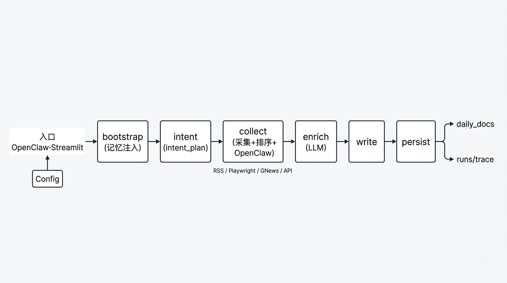

# AI 资讯周报 Agent — 项目架构说明

> **文档定位**：本文件在**仓库根目录下的 `参考资料1/`**，用中文 + 树状图概括**本仓库**主代码（`project/`）结构；风格上对齐 `external/deer-flow/DeerFlow-architecture-ZH.md`（树状目录 + 模块说明）。  
> **更细的英文说明**（分层图、阶段细节、Tool 路径）：见 `project/docs/agent-architecture.md`。  
> **外部借鉴**：`external/` 下为第三方克隆，**不参与**本项目的运行时依赖。  
> **维护说明**：**本文件为中文架构总览的正文**；同目录 `PROJECT-ARCHITECTURE-ZH.md`（若存在）仅为 **ASCII 文件名入口**，**请勿**在后者粘贴完整架构。若编辑器打不开中文路径，用资源管理器打开本文件或见该入口文件中的说明。

**架构总览图**（示意，与下文文字互补）：



---

## 一、整体形态：是不是「多 Agent」？

**生产默认不是 DeerFlow 那种「主 Agent + task 子 Agent」树，而是「LangGraph 状态机 + 确定性流水线」。**

| 维度 | 说明 |
|------|------|
| **主路径** | `run_with_graph`：`StateGraph(DigestState)`，**顶层节点**为 **bootstrap → intent → collect → enrich → write → persist**；失败时在 **`collect` 前**重试（带退避），条件边可落到 `persist`。 |
| **「intent」图节点** | 仅 **`intent_plan_stage`**（可选 LLM 拆检索短语），写入 `intent_plan`。 |
| **「collect」图节点** | 内部顺序：**`collect_stage`**（RSS / 站点爬虫 / GNews / Public API 等）→ **`intent_stage`**（去重、配比、`balance` 后按用户记忆的 **generic 模式** 做重排等）→ **`openclaw_stage`**（热榜，成稿中位于正文条目之后作辅助参考）。 |
| **LLM 角色** | 出现在意图拆词、条目解读与润色（`enrich_stage`）等子步骤，而非全程由模型逐步选工具驱动。 |
| **可选路径** | LangChain **Tool-Calling / Agent**（见 `project/docs/agent-architecture.md` 中 Optional 章节）；失败时可回退到 LangGraph。 |

因此更准确的说法是：**单图编排 + 多阶段流水线**；站点爬虫、RSS、GNews、OpenClaw 等以**代码与配置**为主，而不是多个对话 Agent 并行协作。

---

## 二、仓库树状结构（核心与数据）

以下为**本仓库**逻辑树；省略 `.git`、`__pycache__` 等；**不包含**与本对话无关的其它实验目录；`external/` 仅标一层。

```
ai_news_skill/
├── README.md                    # 产品说明、环境变量、快速命令
├── SKILL.md                     # OpenClaw Skill 说明（触发词、命令）
├── sources.json                 # RSS / 信源配置
├── requirements.txt
├── .env.example
├── daily_docs/                  # ★ 周报 Markdown 输出目录
├── runs/                        # ★ 单次运行 trace、run_id、user_news_memory.json 等
│
├── project/                     # ★ 主代码（运行时常以本目录为工作目录）
│   ├── run_daily_digest.py      # ★ 采集、GNews、去重、平衡、渲染 Markdown 核心脚本
│   ├── langgraph_agent.py       # 薄封装：从 skill 包重导出图与状态（便于根级 import）
│   ├── app.py                   # Streamlit UI 入口（exec 加载 ai_news_skill/ui/app.py）
│   ├── agent_runtime.py         # 重导出 ai_news_skill.runtime.agent_runtime
│   ├── digest_tools.py          # 与编排相关的工具注册 / 顶层 shim
│   ├── agent_tool_runner.py     # Tool Agent 路径（可选）
│   ├── mcp_bridge.py            # MCP 相关桥接（若启用）
│   │
│   ├── ai_news_skill/           # ★ 技能包形态的核心包
│   │   ├── user_news_memory.py  # ★ 长期记忆、classify_query_mode、attach_memory_to_config
│   │   ├── runtime/
│   │   │   └── agent_runtime.py # ★ 流水线阶段：collect / intent / openclaw / enrich / write
│   │   ├── orchestration/
│   │   │   ├── langgraph_agent.py   # ★ StateGraph、DigestState、run_with_graph
│   │   │   ├── digest_tools.py
│   │   │   └── agent_tool_runner.py
│   │   ├── pipeline/
│   │   │   └── run_daily_digest.py  # 对顶层 run_daily_digest 的再导出
│   │   ├── crawlers/
│   │   │   └── site/            # ★ 站点定制爬虫（见第七节注册表）
│   │   ├── ui/
│   │   │   └── app.py           # Streamlit 表单、进度、调用图或脚本
│   │   └── integrations/
│   │       ├── mcp_bridge.py
│   │       └── public_api_feeds.py  # NYT、Guardian、HN、GitHub 等扩展信源
│   │
│   ├── middleware/
│   │   └── pipeline_middleware.py   # 流水线日志 / 事件
│   ├── model/
│   │   └── llm_factory.py           # LLM 构造
│   ├── prompts/
│   │   └── digest_llm_prompts.py    # 与 digest 相关的提示片段
│   ├── chains/
│   │   └── news_enrich_chain.py     # 富化链（若使用）
│   ├── site_crawlers/               # 站点爬虫的另一份实现/遗留（与 skill 内 crawlers 并存时注意维护策略）
│   ├── scripts/                     # 一次性脚本、样例
│   ├── test_harness_crawl/          # 爬取试验与样例输出
│   └── docs/
│       ├── agent-architecture.md    # ★ 英文：架构详解、数据流、阶段说明
│       └── restructure-root-clean.md
│
└── external/                    # 外部参考（如 deer-flow、FinnewsHunter）；非本产物依赖
```

**运行提示**：`SKILL.md` / `README` 中的 `python3 run_daily_digest.py ...` 一般指在 **`project/`** 下执行（或已将 `project` 加入 `PYTHONPATH`），以实际脚本路径为准。

---

## 三、编排与数据流（简图）

**LangGraph 顶层**：

```
用户 / OpenClaw / Streamlit
        │
        ▼  组装 config（intent_text、窗口、OpenClaw 开关、LLM 等）
        │
┌───────┴───────────────────────────────────────────────────────────────┐
│  LangGraph：run_with_graph                                             │
│  bootstrap → intent → collect → enrich → write → persist → END         │
│       │        │        │         │        │                            │
│       │        │        │         │        └─→ daily_docs/*.md          │
│       │        │        │         └─→ LLM 解读 / 要点 / 标题等           │
│       │        │        └─→ 见下「collect 内部」                        │
│       │        └─→ intent_plan（可选 LLM 拆检索短语）                   │
│       └─→ attach_memory_to_config；runs/<run_id>/、trace.json           │
└────────────────────────────────────────────────────────────────────────┘
```

**collect 图节点内部**（代码在 `_collect_node`）：

```
collect_stage（信源 + 站点 + GNews + API…）
        → intent_stage（去重、配比、generic 下记忆重排等）
        → openclaw_stage（热榜）
```

**与 `run_daily_digest.py` 的关系**：**collect / enrich / write** 所依赖的去重、配比、渲染等大量逻辑在 **`project/run_daily_digest.py`**；**阶段顺序与 trace** 由 **`ai_news_skill/runtime/agent_runtime.py`** 与 **`orchestration/langgraph_agent.py`** 组织。

---

## 四、核心模块说明（按职责）

| 模块路径（相对 `project/`） | 中文职责 |
|----------------------------|----------|
| `run_daily_digest.py` | 信源加载、HTTP/RSS、GNews、条目规范化、去重与论文比例、Markdown 渲染、写文件。 |
| `ai_news_skill/runtime/agent_runtime.py` | 单次运行的 **阶段函数**：采集、`intent_stage`、`openclaw`、富化、写稿、finalize、可选 `run_digest_pipeline`。 |
| `ai_news_skill/orchestration/langgraph_agent.py` | **DigestState**、各 node、条件边（重试回 `collect`）、`build_workflow` / `run_with_graph`；`bootstrap` 中调用 `attach_memory_to_config`。 |
| `ai_news_skill/user_news_memory.py` | 长期记忆 JSON、`classify_query_mode`（generic / explicit）、`attach_memory_to_config`、可选 LLM 合并记忆。 |
| `ai_news_skill/crawlers/site/*.py` | **站点定制**列表页/详情解析，经 `registry.py` 与 `sources.json` 的 `name` 精确匹配。 |
| `ai_news_skill/integrations/public_api_feeds.py` | 公共 API 扩展信源。 |
| `ai_news_skill/ui/app.py` | 本地 Web UI：配置运行参数、展示进度与结果路径。 |
| `middleware/pipeline_middleware.py` | 流水线步骤对外可观测性（与 `emit_step` 配合）。 |
| `model/llm_factory.py` | 统一创建聊天模型实例。 |
| `prompts/digest_llm_prompts.py` | Digest 相关 LLM 提示维护。 |

---

## 五、用户长期记忆（generic / explicit）

- **存储**：默认 `runs/user_news_memory.json`（profile、关键词、板块、排除信源等）；可用环境变量关闭（见 `.env.example`）。  
- **注入时机**：图在 **`bootstrap`** 中根据 `sources.json` 所在目录解析仓库根并调用 `attach_memory_to_config`。  
- **`classify_query_mode(intent_text)`**（规则为主，可选 LLM 辅助）：  
  - **generic（泛化浏览）**：如「看看最近新闻 / 随便看看 / 来份周报」等弱主题句式。  
  - **explicit（显式主题）**：含强检索意图或主题线索时；默认也可将「当前句自带主题」归为 explicit，避免被误判为泛化。  
- **`attach_memory_to_config` 分支**：  
  - **generic**：合并记忆里的 `extra_keywords`、`prefer_categories`、`profile`；排除信源仍生效；在 **`intent_stage`** 于 `balance` 之后可对条目做 **重排加权**（仅当记忆中有 boost 信息时），trace 中可见 `intent_rank`（`user_memory_boost`）。  
  - **explicit**：不按记忆合并主题关键词；仍应用排除信源；工具 Agent 的 system 块等行为以代码为准（见 `user_news_memory.py`）。  
- **会话多轮**：Streamlit 内仍以页面状态展示聊天记录；**未**单独落库为结构化 Context 文件（与 `user_news_memory` 长期文件分工不同）。

---

## 六、配置与产物

| 类型 | 路径 | 说明 |
|------|------|------|
| 信源列表 | 根目录 `sources.json` | RSS URL、分类等（运行时常与 `project` 工作目录一致，注意 cwd）。 |
| 环境 | `.env` / `.env.example` | Ark、OpenAI 兼容、可选 Webhook、记忆开关等。 |
| 输出报告 | `daily_docs/` | 如 `ai_weekly_YYYYMMDD.md`。 |
| 运行痕迹 | `runs/<run_id>/` | `trace.json` 等，便于排查采集与 LLM 步骤。 |
| 用户记忆 | `runs/user_news_memory.json` | 长期偏好（若启用）。 |

---

## 七、抓取与站点爬虫（概要）

主流程中除 **RSS/Atom**（`collect_news` → `_collect_one_rss_source`，信源来自 `sources.json`）外，还包括：

| 类型 | 位置（概要） | 说明 |
|------|----------------|------|
| 站点列表爬取（Playwright） | `ai_news_skill/crawlers/site/*.py` + `registry.py` | 与 `sources.json` 的 `name` 精确匹配；受 `site_crawlers_effective()`、`DIGEST_FAST*`、`SITE_CRAWLERS_ENABLED` 等控制，跳过时 trace 可见 `site_crawl skipped`。 |
| 正文兜底 | `run_daily_digest.fetch_article_excerpt` 等 | HTTP + trafilatura（非 Playwright）。 |
| GNews | `run_daily_digest` 内相关函数 | GNews HTTP API。 |
| Public API | `ai_news_skill/integrations/public_api_feeds.py` | NYT、Guardian、HN、GitHub 等。 |
| OpenClaw 热榜 | `openclaw_stage` | 配置开启时 HTTP 拉取。 |

**Playwright 站点爬虫注册表**（`ai_news_skill/crawlers/site/registry.py`，须与 `sources.json` 中 `name` 一致）：

| 类名 | `name` | 说明 |
|------|--------|------|
| `OpenAINewsCrawler` | OpenAI Blog | 列表页 + 滚动；与 RSS 可并存 |
| `AnthropicNewsCrawler` | Anthropic Blog(OpenRSS) | Playwright 滚动与详情 |
| `HuggingFaceBlogCrawler` | Hugging Face Blog | Playwright |
| `TechCrunchAICrawler` | TechCrunch AI | Playwright |
| `TechmemeCrawler` | Techmeme | Playwright |
| `VentureBeatAICrawler` | VentureBeat AI | Playwright |

`project/site_crawlers/` 下另有历史/重复实现，入口以 `ai_news_skill/crawlers/site` 为准。

---

## 八、维护建议

1. **改采集逻辑**：优先看 `run_daily_digest.py` 与 `crawlers/site/`。  
2. **改流程顺序或重试策略**：改 `ai_news_skill/orchestration/langgraph_agent.py`。  
3. **改阶段内行为（OpenClaw、富化、排序）**：改 `ai_news_skill/runtime/agent_runtime.py`。  
4. **改用户记忆与 generic/explicit 行为**：改 `ai_news_skill/user_news_memory.py`。  
5. **英文深度架构、Tool 回退路径**：与 `project/docs/agent-architecture.md` 同步更新。

---

*文档随当前仓库结构整理；若目录调整，请同步更新本节树状图与架构图。*
